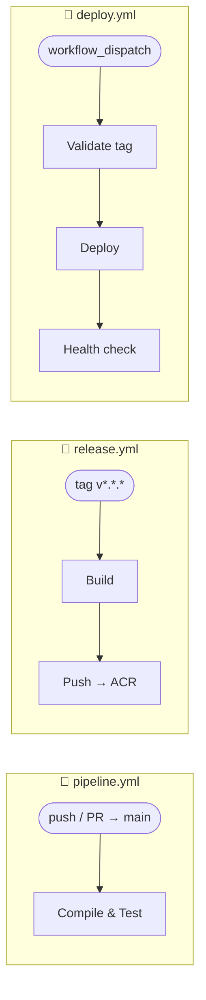
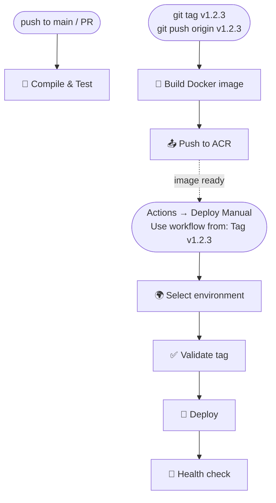

# flow

A proof-of-concept CI/CD pipeline using **GitHub Actions**, demonstrating a clean separation of concerns across three independent workflows: continuous integration, image release, and manual deployment.

---

## Workflows



### 🔨 CI (`pipeline.yml`)
Runs on every push to `main` and on pull requests. Compiles the project and executes the test suite.

### 🚀 Release (`release.yml`)
Triggered automatically when a version tag is pushed. Builds the Docker image and publishes it to Azure Container Registry (ACR).

### 🔧 Deploy Manual (`deploy.yml`)
Triggered manually from the Actions tab. Select the tag via **"Use workflow from"** and choose the target environment from the dropdown. Supports environment protection rules (approvals, wait timers).

---

## Flow



---

## Getting started

### 1. Create a release

```bash
git tag v1.0.0
git push origin v1.0.0
```

The `release.yml` workflow fires automatically, builds the image and pushes it to ACR.

### 2. Deploy to an environment

1. Go to **Actions → Deploy Manual → Run workflow**
2. Under **"Use workflow from"**, select **Tag** → pick the tag (e.g. `v1.0.0`)
3. Select the **target environment**
4. Click **Run workflow**

---

## Environments

Configure environments under **Settings → Environments**.

| Environment | Recommended protection rules |
|-------------|------------------------------|
| `development` | None — deploys automatically |
| `staging` | Wait timer: 5 min |
| `production` | Required reviewers: 1+ approver |

---

## Configuration

Update the global variables in `release.yml` and `deploy.yml`:

```yaml
env:
  ACR_NAME: myregistry   # Azure Container Registry name
  IMAGE_NAME: my-app     # Docker image name
```

Add the following secrets under **Settings → Secrets and variables → Actions**:

| Secret | Description |
|--------|-------------|
| `AZURE_CLIENT_ID` | Service Principal for Azure login |
| `AZURE_CLIENT_SECRET` | Service Principal credentials |
| `AZURE_TENANT_ID` | Azure AD tenant |
| `AZURE_SUBSCRIPTION_ID` | Azure subscription |

---

## Documentation

See [`.github/PIPELINE.md`](.github/PIPELINE.md) for full pipeline documentation.
